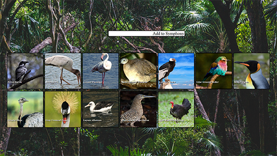

# Symphony of Birds
A React application that allows users to create music through Bird Calls.

**Link to project:** [Symphony of Birds](https://symphony-of-birds.netlify.app/)

  

## How It's Made:

**Tech used:** React, JavaScript, HTML, CSS, Node.JS, Express

The React application sends HTTP requests to the Node.js server, which then processes the requests and returns the necessary data. This data is then rendered in the React application, allowing for dynamic updates and a seamless user experience. The communication between the frontend and backend is done through a REST API. The Node.js server processes these requests with the help of the Xeno Cantu API and the Google Custom Search API, performs any necessary operations, and returns the results to the React application, allowing for the dynamic updates of the website. The backend incorporates API caching and API rate limiting for added functionality.

## Lessons Learned:

- Understanding of component-based architecture and how to structure a React app
- Appreciation for the virtual DOM and how fast it can update the front end
- Experience with state management and utilization of React hooks to handle state
- Handling API calls with useEffect and managing dependencies to optimize performance
